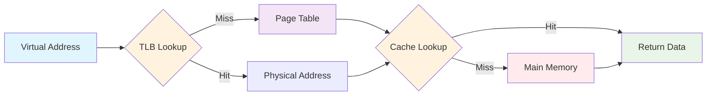

<div align="center">

# 🧠 Memory System Simulator

**Modern Implementation of Memory Hierarchy Components**

[](https://python.org)
[](LICENSE)
[](https://github.com/Wanni46/Memory-System-Simulator)

*Simulating TLB, Page Table, Cache, and Main Memory interactions*

[🚀 Quick Start](#-quick-start) • [📖 Documentation](#-documentation) • [🎯 Features](#-features) • [🤝 Contributing](#-contributing)

</div>

---

## 🎯 Features

<table>
<tr>
<td>

🔄 **TLB Simulation**
- Fast address translation cache
- FIFO replacement policy
- Hit/miss tracking

</td>
<td>

📊 **Page Table**
- 1:1 virtual-physical mapping
- No page fault simulation
- Consistent address resolution

</td>
</tr>
<tr>
<td>

⚡ **Cache System**
- FIFO replacement algorithm
- Performance metrics
- Real-time statistics

</td>
<td>

💾 **Main Memory**
- Simulated RAM access
- Data retrieval simulation
- Latency modeling

</td>
</tr>
</table>

---

## 🏗️ System Architecture



---

## 🚀 Quick Start

### Prerequisites
```bash
# Ensure you have Python 3.x installed
python --version
```

### Installation
```bash
# Clone the repository
git clone https://github.com/Wanni46/Memory-System-Simulator.git

# Navigate to project directory
cd Memory-System-Simulator

# Run the simulator
python simulator.py
```

---

## 💻 Usage

### Interactive Mode
```console
$ python memory_simulator.py

🧠 MEMORY SYSTEM SIMULATOR INITIALIZED
━━━━━━━━━━━━━━━━━━━━━━━━━━━━━━━━━━━━━━━━

Enter virtual addresses (0-19) or 'exit' to quit:

> 3
🔍 TLB: MISS
📋 Page Table: HIT
💾 Cache: MISS → Fetching from RAM...
✅ Data: 20

> 7
🔍 TLB: MISS  
📋 Page Table: HIT
⚡ Cache: HIT
✅ Data: 14
```

---

## 📊 Performance Metrics

<div align="center">

### Sample Statistics Output

```
╭─────────────────────────────╮
│     📈 SIMULATION STATS     │
├─────────────────────────────┤
│ TLB Hits:        15         │
│ TLB Misses:      5          │
│ Cache Hits:      12         │
│ Cache Misses:    8          │
├─────────────────────────────┤
│ TLB Hit Rate:    75.00%     │
│ Cache Hit Rate:  60.00%     │
╰─────────────────────────────╯
```

</div>

---

## 🔧 Technical Details

<details>
<summary><b>🏛️ Memory Hierarchy Components</b></summary>

### Translation Lookaside Buffer (TLB)
- **Purpose**: Cache recent virtual-to-physical address translations
- **Size**: Configurable (default: small cache)
- **Policy**: FIFO replacement
- **Performance**: Dramatically reduces translation overhead

### Page Table
- **Mapping**: 1:1 virtual to physical pages
- **Implementation**: Hash-based lookup
- **Fault Handling**: No page faults in current simulation
- **Access**: Direct mapping for predictable behavior

### Cache Memory
- **Type**: Unified instruction/data cache
- **Algorithm**: FIFO replacement
- **Levels**: Single-level cache simulation
- **Metrics**: Hit rate, miss penalty tracking

### Main Memory
- **Access**: Simulated RAM with realistic delays
- **Capacity**: Configurable memory size
- **Data**: Random data generation for testing
- **Latency**: Simulated memory access times

</details>

---

## 📚 Educational Applications

| Concept | Learning Outcome |
|---------|------------------|
| 🎓 **Virtual Memory** | Understanding address translation |
| ⚡ **Cache Performance** | Hit/miss ratio optimization |
| 🔄 **Replacement Policies** | FIFO algorithm implementation |
| 📊 **System Performance** | Memory hierarchy bottlenecks |

---

## 🤝 Contributing

We welcome contributions! Here's how to get started:

### 🌟 Ways to Contribute
- 🐛 **Bug Reports**: Found an issue? [Open an issue](https://github.com/Wanni46/Memory-System-Simulator/issues)
- 💡 **Feature Requests**: Have ideas? We'd love to hear them!
- 🔧 **Code Improvements**: Submit a pull request
- 📖 **Documentation**: Help improve our docs

### 🚀 Development Setup
```bash
# Fork the repository
git clone https://github.com/YOUR_USERNAME/Memory-System-Simulator.git

# Create feature branch
git checkout -b feature/amazing-feature

# Make changes and commit
git commit -m "Add amazing feature"

# Push and create PR
git push origin feature/amazing-feature
```

---

## 🎓 Academic References

<details>
<summary><b>📖 Recommended Reading</b></summary>

1. **Silberschatz, A., Galvin, P. B., & Gagne, G.** - *Operating System Concepts* (10th Edition)
2. **Hennessy, J. L., & Patterson, D. A.** - *Computer Architecture: A Quantitative Approach*
3. **Stallings, W.** - *Operating Systems: Internals and Design Principles*
4. **Tanenbaum, A. S.** - *Modern Operating Systems*

</details>

---

## 📄 License

This project is licensed under the MIT License - see the [LICENSE](LICENSE) file for details.

---

## 👨‍💻 Author

<div align="center">

**Pasindu Dhananjaya Wanninayake**

[](https://github.com/Wanni46)
[]([https://linkedin.com/in/your-profile](https://lk.linkedin.com/in/pasindu-dhananjaya-wanninayake-759877235))

*Computer Science Student | Systems Programming Enthusiast*

</div>

---

<div align="center">

### 🌟 Show Your Support

If this project helped you understand memory systems better, please consider:

[](https://github.com/Wanni46/Memory-System-Simulator)
[](https://github.com/Wanni46/Memory-System-Simulator/fork)

**Made with ❤️ for learning and education**

</div>

---

<details>
<summary><b>🔍 Project Statistics</b></summary>


</details>
